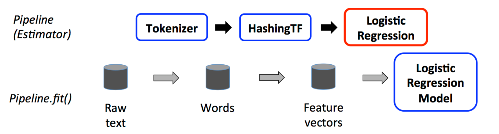
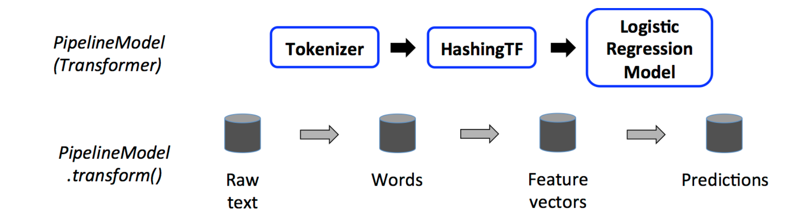

## Sentimental-Analysis-on-Drug-Reviews-using-NLP
Analysis of the drugs name, conditions, reviews and its recommendation for health condition of a patient.

## Problem Statement


Online health-related sites and opinion forums contain ample information about the user's preferences and experiences over multiple drugs and treatment. This information can be leveraged to obtain valuable insights using data mining approaches such as sentiment analysis. Sentiment analysis measures the inclination of people’s opinions through techniques like text analysis and natural language processing. Online user reviews in this domain contain information related to multiple aspects such as the effectiveness of drugs and side effects, which make automatic analysis very interesting but also challenging. However, analyzing the sentiments of drug reviews can provide valuable insights. They might help pharmaceutical companies and doctors to quickly get into bad reviews and know patients' complaints. This sentiment analysis on drug reviews is basically modeled as a classification problem (i.e.,) classifying the sentiment of the user whether positive, negative or neutral based on their choice of words and their reviews. A lot of symptoms and drug sides were hidden under reviews, which will be great to be automatically extracted to improve the drug and help to give a better prescription.

## Question to answer from the data:
- Can you predict the patient's condition based on the review?
- Can you predict the rating of the drug based on the review?
- Can you determine if a review is positive, neutral, or negative?
- What are the key factors of sentiment derived from rating on basis of drug review?

### Data Dictionary:
Name | Description
-----|-------------
uniqueID|Unique id for the review
drugName|Name of the drug
condition|Name of condition
Review|Patient review
date|Date of review entry
usefulCount| number of users who found review useful

### How is Data Preprocessing done in Apache Spark?
1. Fit pipeline

2. Transform Pipeline


## Usage

### 1. **Web Dashboard (Recommended for Business/Pharmacology Teams)**

- **Streamlit App:**  
  Launch the interactive dashboard for exploring sentiment, trends, and model comparison.
  ```bash
  streamlit run app.py
  ```
  - Upload your training and test CSV files via the sidebar.
  - Select model(s), filter by condition, and view insights and downloadable results.

### 2. **Python Pipeline (CLI/Script Mode)**

- **Run the training and evaluation pipeline:**
  ```bash
  python main.py --train data/train_raw.csv --test data/test_raw.csv --model logistic
  ```
  - Replace `logistic` with `random_forest`, `svm`, `naive_bayes`, or `hf_transformer` for other models.
  - Outputs predictions and metrics to the console and saves results to disk.

### 3. **Jupyter Notebooks**

- **Experiment and prototype in notebooks:**
  - Notebooks for data exploration and model experimentation are located in the `notebooks/` directory.

### 4. **Testing**

- **Run all unit tests to ensure code quality and correctness:**
  ```bash
  pytest -q
  ```
  or, for standard unittest:
  ```bash
  python -m unittest discover -s tests
  ```
- Test files are located in the `tests/` directory and cover data loading, preprocessing, and model functionality.
- Make sure your test data files exist at the specified paths or update the test scripts accordingly.

---

**Note:**  
- For large models (e.g., transformers), ensure you have sufficient hardware or use quantized versions.
